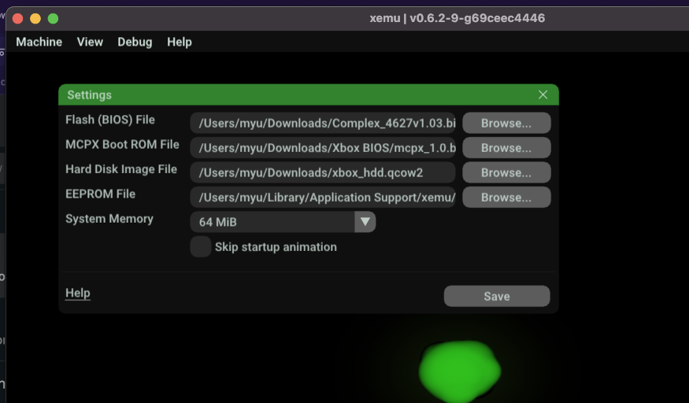

## xemu guide for macOS

v 1.0

### Software

Download xemu : https://github.com/mborgerson/xemu/releases/latest/download/xemu-macos-universal-release.zip

Download BIOS (Complex_4627v1.03.bin)  : https://downloads.diodematrix.com/homebrew/xbins/Console%20Based%20Applications/bios/complex/complex4627v1.03.rar

Download MCPX boot ROM (mpcx_1.0.bin) : https://www.mediafire.com/file/28zvvhqxjuoj4dp/Xbox_BIOS.zip/file

Download xemu HDD file : https://github.com/mborgerson/xemu-hdd-image/releases/download/1.0/xbox_hdd.qcow2.zip

Start xemu, at first boot allow "input monitoring" in macOS System prefs/Security/Privacy

Go to xemu settings, put the files where they belong (BIOS, MPCX, HDD)

try to reboot xemu -> Should have XBOX BIOS boot, no dashboard UI, that's normal.

Download Xbox ISO

Unpack ISO -> Becomes a folder

### Build extract-iso to repack into xISO

Download Cmake https://github.com/Kitware/CMake/releases/download/v3.22.0/cmake-3.22.0-macos-universal.dmg

Clone (git) or unzip https://github.com/XboxDev/extract-xiso

Terminal :

	cd extract-xiso
	mkdir build
	cd build
    /Applications/CMake.app/Contents/bin/cmake .
	make

Build ISO (example) :

    ./extract-xiso -c /Users/myu/Downloads/Jet\ Set\ Radio\ Future/

Start xemu with ISO.

